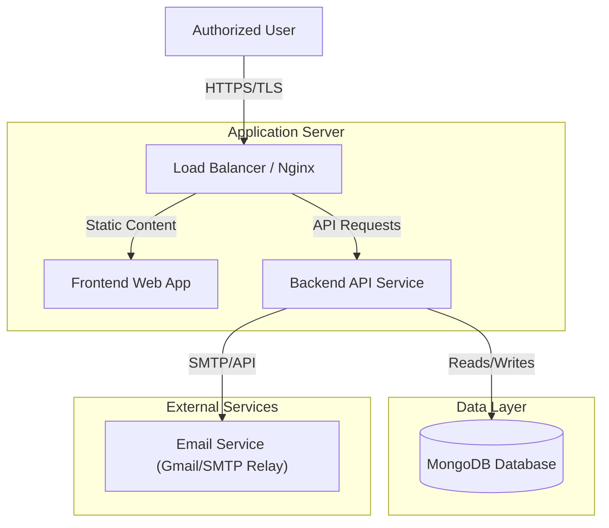
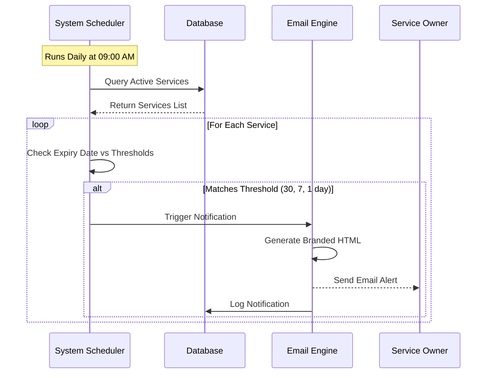
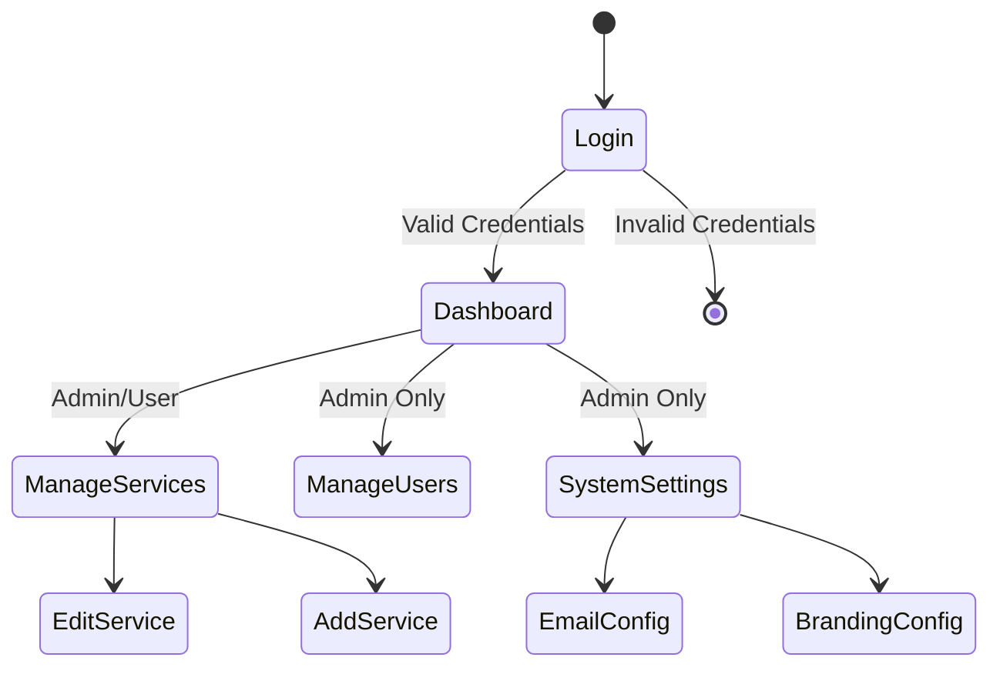
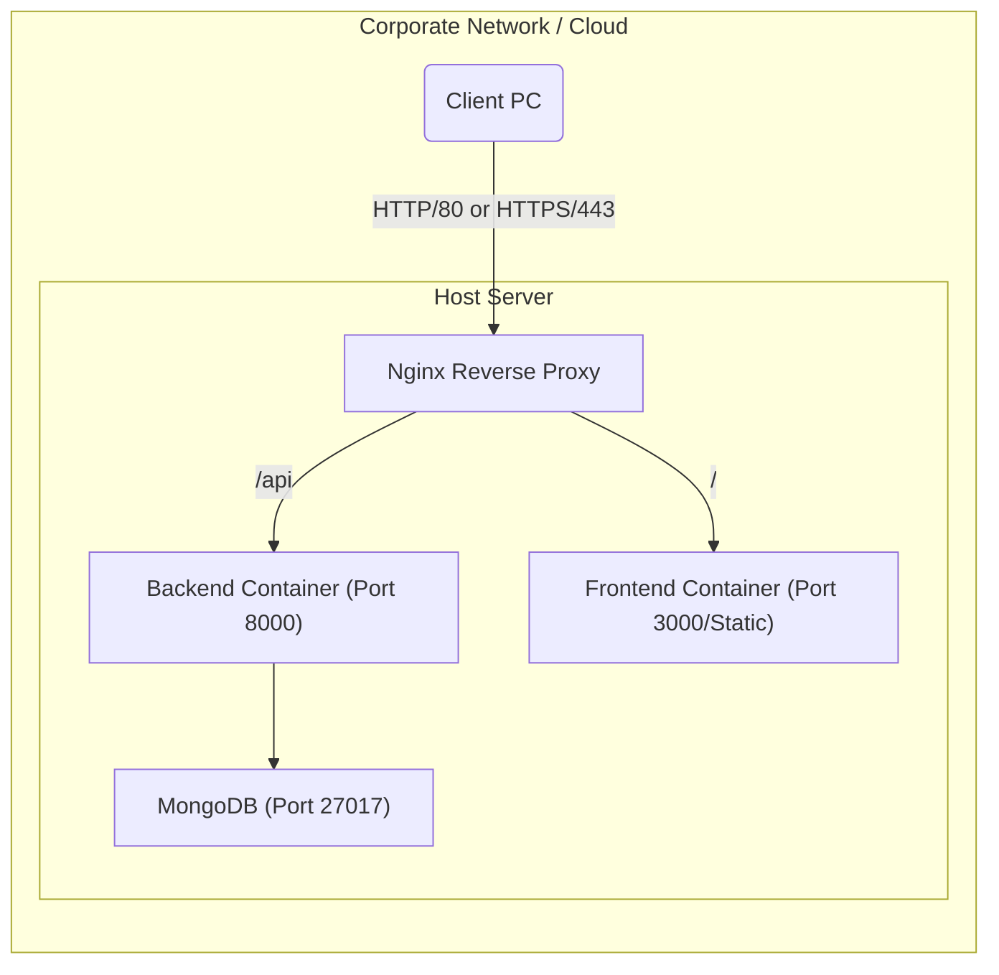

# Service Renewal Hub - System Overview

## 1. Executive Summary
The Service Renewal Hub is a centralized application designed to manage software licenses, track expiry dates, and automate notifications to ensure business continuity. It provides a dashboard for tracking costs and upcoming renewals, reducing the risk of service interruptions.

## 2. High-Level Architecture

The system follows a modern 3-tier architecture:

### Components
*   **Frontend Web App**: Built with **React** and **Tailwind CSS**, providing a responsive and modern user interface for managing services.
*   **Backend API Service**: powered by **Python FastAPI**, handling business logic, authentication, and background scheduling.
*   **Database**: **MongoDB** is used for flexible storage of service records, user profiles, and logs.
*   **Email Engine**: An asynchronous email dispatcher that supports both direct SMTP (e.g., Gmail) and API-based providers (e.g., Resend).

## 3. Core Workflows

### 3.1 License Expiry & Notification Process
This automated workflow runs daily to identify and notify stakeholders of expiring services.

### 3.2 User Management & Authentication
Secure access control ensures only authorized personnel can manage sensitive license data.

## 4. Technical Stack

| Component | Technology | Key Features |
|-----------|------------|--------------|
| **Frontend** | React 18, Tailwind CSS | Responsive UI, Dark Mode, Interactive Dashboard |
| **Backend** | Python 3.9+, FastAPI | High Performance, Async I/O, Auto-Documentation |
| **Database** | MongoDB | Scalable JSON storage, dynamic schemas |
| **Security** | JWT, bcrypt | Secure session management, password hashing |
| **Infrastructure** | Docker (Optional) | Portable containerized deployment |

## 5. Deployment Diagram

## 6. Security Features
*   **Encryption**: All passwords are hashed using **bcrypt** before storage.
*   **Transmission**: System supports TLS for all email communications.
*   **Access Control**: Role-Based Access Control (RBAC) separates Administrators from Standard Users.
